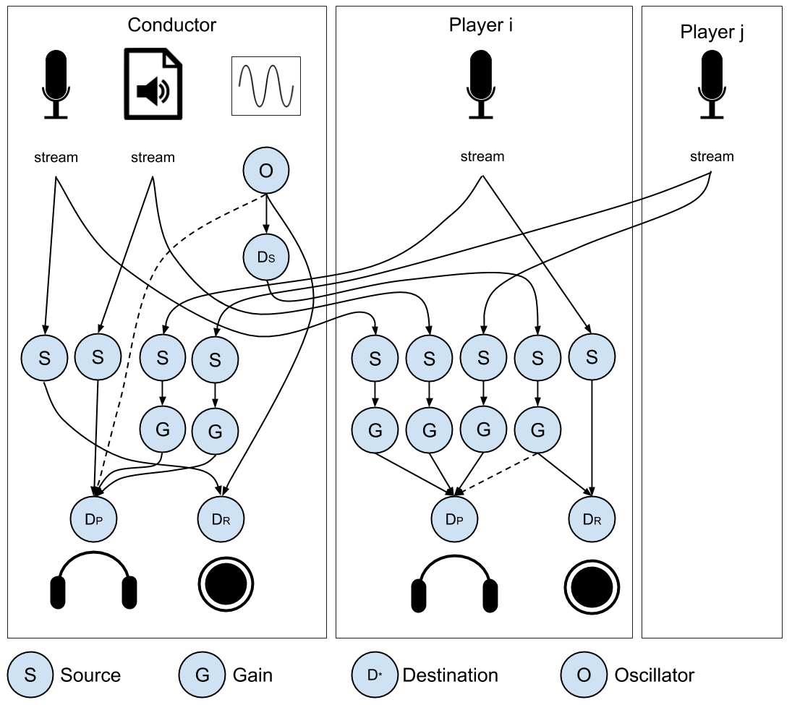

# remote_rehearsal
Fast remote conference system for music rehearsals

## Goal
Enable remote rehearsals of music ensembles, which is impossible with off-the-shelf teleconference systems due to large and varying delays.

## Features
* Minimum latency by using a dedicated signaling server and turning off all audio processing (auto gain control, noise suppression, echo cancellation)
* Two preset views for different roles:
  * Conductor: players displayed in the large center area as grid
  * Players: conductor displayed in the large center area; other players at the bottom
* Automatic sync/merge of conductor/player videos + instant replay of the merged video
* Conductor can share audio from a file (e.g. to play along)

## Building and Running
### Signaling server
Tested on Ubuntu 18.04.
Requires [node.js](https://nodejs.org/en/). 

The main script is [server/app.js](https://github.com/kyamane/remote_rehearsal/blob/main/server/app.js).
To allow connections from clients not on localhost, you'll need an SSL server with a verified certificate.
```
$ cd server
$ npm install
$ node app.js
```

### Client
Tested with Chrome Version 85.0.4183.102 (Official Build) on Ubuntu 18.04 / Windows 10 / Mac OS 10 and [Apache Tomcat](http://tomcat.apache.org/) 9.0.38 running on Ubuntu 18.04. Currently uses Java Servlet, JavaScript and HTML.

The main html file is [client/src/main/webapp/index.html](https://github.com/kyamane/remote_rehearsal/blob/main/client/src/main/webapp/index.html).
The easiest way to build and deploy the client is to use gradle and tomcat.
```
$ cd client
$ gradle eclipse
$ gradle build
$ cp build/libs/remote_rehearsal.war /tomcat_install_directory/webapps
```
Again, you'll need an SSL server with a verified certificate to connection from clients other than localhost.

## Usage
1. Echo cancellation is turned off, so make sure that the microphone does not pick up the sound from the system (i.e. always use a headset). 
1. Open the main HTML file in the latest version of Chrome.
1. Input your name to the text box, check the conductor box if you are the conductor, and click "Join."
Note that the behavior in case multiple conductors exist in the rehearsal is undefined ;)
1. The conductor interface inlcudes a "Record" button. By pressing this button, you can record all player video/audio and generate a synchronized video.
1. Click "Leave" to leave the rehearsal.

## Video Sync Details

Videos are synchronized using a sync sound added to the conductor's audio signal. The sync sound is a simple oscillation that lasts 2 seconds after the "record" button is clicked.

### Audio Played

Everyone hears everyone else's audio stream and the shared audio file. Sync sound is currently audible as well for debugging purpose, but will be removed in the future.

Role\Input | Conductor | Shared audio | Sync | Player *i* | Player *j* (<>*i*)
-----------|-----------|--------------|------|------------|------------------
Conductor | No | Yes | Yes | Yes | Yes
Player *i* | Yes | Yes | Yes | No | Yes
Player *j* | Yes | Yes | Yes | Yes | No

### Audio Recorded

The local audio stream and sync sound are recorded. The sync sound is used for synchronizing the videos with possibly different delays.

Role\Input | Conductor | Sync | Player *i* | Player *j* (<>*i*)
-----------|-----------|------|------------|------------------
Conductor | Yes | Yes | No | No
Player *i* | No | Yes | Yes | No
Player *j* | No | Yes | No | Yes

Here is a graphical representation:



### Data processing

1. The players' video and audio streams are sent to the conductor's local machine via the socket server.
1. The video and audio data are sent to the Java servlet via WebSocket.
1. The Java servlet looks for the sync sound in each audio data and determines the delay of each player's video and audio.
1. The video and audio data are merged using [ffmpeg](https://ffmpeg.org/).

## Future Plan
- [ ] Turn on/off audio of individual player
- [ ] In the conductor view, arrange the player videos in the standard orchestra layout.
- [ ] Conductor movement prediction: 1) build a (DNN?) model of conductor movement, perhaps using data from skeleton tracking with Azure Kinect; 2) learn a model to reconstruct conductor appearance from skeleton movement; 3) during rehearsal, show the conductor movement 2T seconds ahead of real time to the players, where T is the one-way latency between the conductor and players. Theoretically, the conductor should hear the sound like in an in-person rehearsal.
